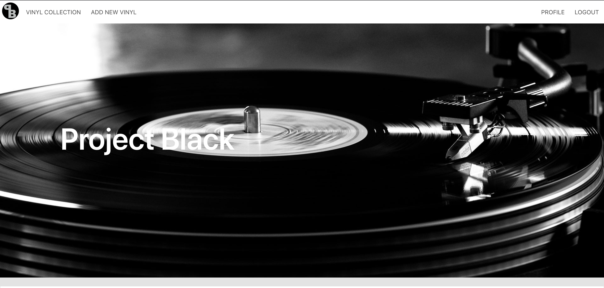
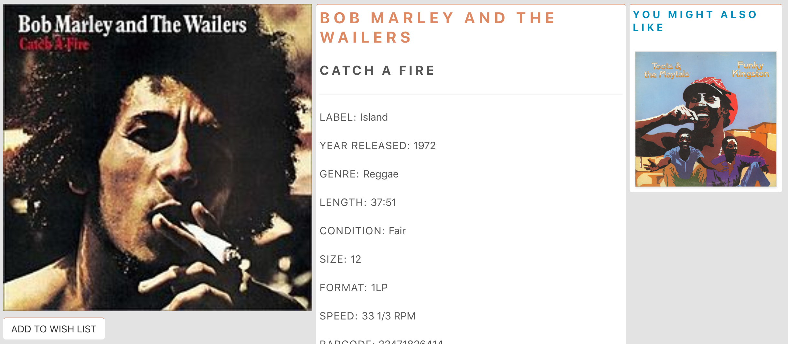
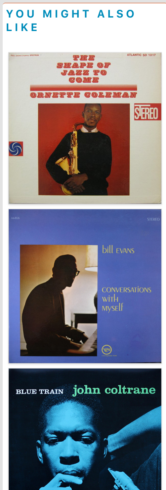
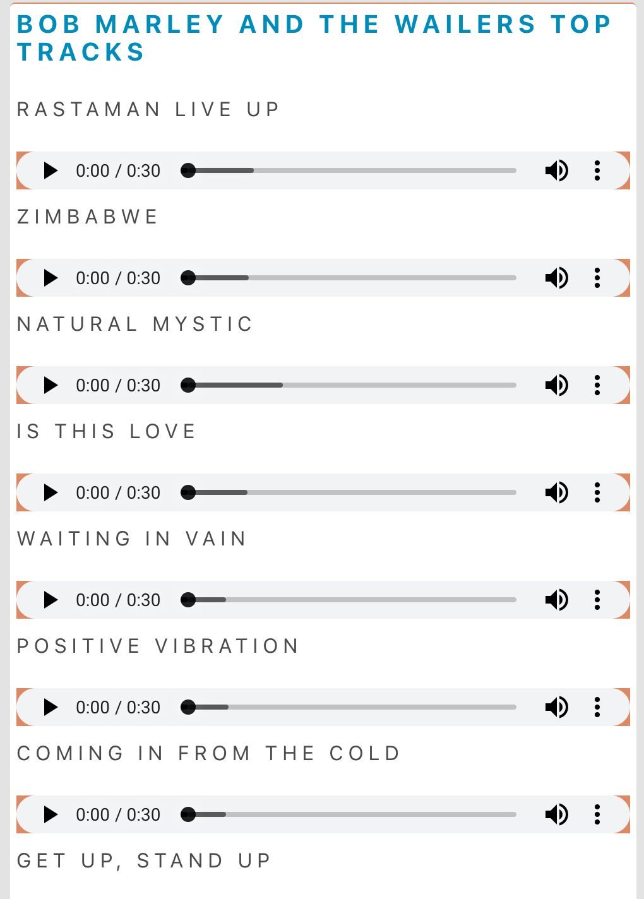
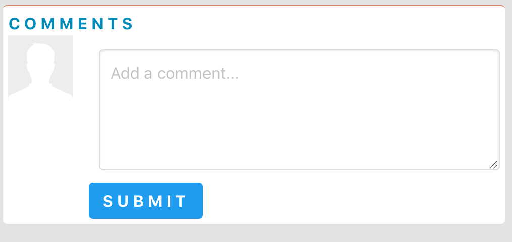
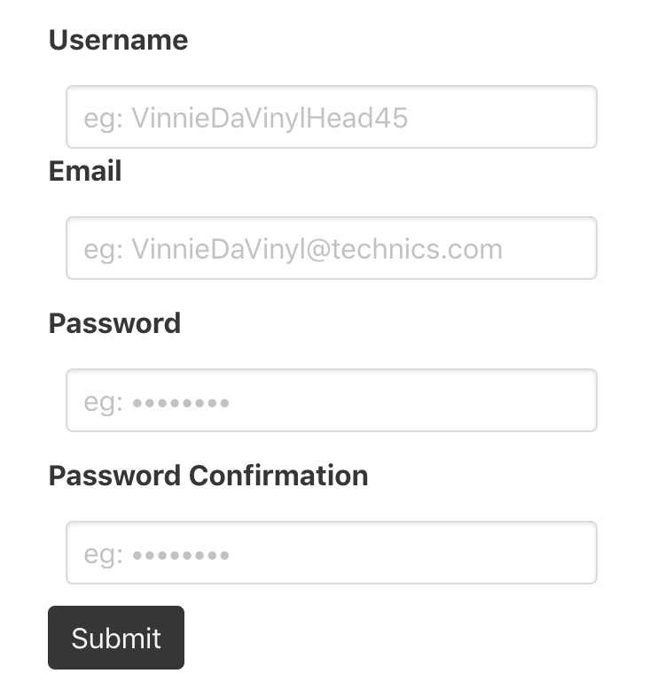

# SEI-Project-3 - Project Black


## Timeframe
7 days

## Technologies used
Frontend: HTML, SCSS, Bulma, React.js, Webpack, Axios, Babel, Promise
Backend: Node.js, Express, MongoDB, Mongoose, Bluebird

## Installation

1. Clone or download the repo
2. Run 'yarn init' in the terminal

## Overview


## Introduction

As a group we are all very proud of our record collections and so we were quickly able to settle on a concept for our app. Project Black not only allows users to post their own records and browse those of others but also through use of the LastFM API to listen to snippets from individual tracks.

## Database

Unlike our previous project, where we relied entirely on third-party APIs, here we were required to build our own database. We started by planning out our Vinyl model and then sketched out our user model. These formed the foundation of our project, upon which we would later embed information such as comments and a user wishlist.

After installing key dependencies (see technologies), we created an app.js page and set up a 'Hello world' message running on localhost:4000. Next we stored this port variable in an environment.js file in our config folder. Then, while half of the group worked on the user and vinyl models, the other half started creating the users, vinyls, and auth controllers. After this we exported routes from our controllers files into a routes file in our config folder.

Once we had completed the models we created a seeds file, to make it easier to update the database. We then looked at authorisation, creating a secureRoute file, to make sure that only logged in users would be able to add vinyls to the site and then delete or update only their own collections.

## HomePage / landing page



The homepage is divided into three sections: main hero (above), recently added, and genres.

The 'recently added' section presented some challenges, as this was the first time that we had worked with timestamps when building models. Another problem arose when we tried to sort an array according to this property. While we had the right approach in principle, we had not realised that we needed to use JavaScript's Date functionality, if we wanted to compare one property with another.

```
function orderByDate(arr) {
  return arr.slice().sort(function (a, b) {
    const aDate = new Date(a.createdAt)
    const bDate = new Date(b.createdAt)
    return bDate - aDate
  })
}
```

Finally the hoverable icons at the bottom of the page allow the user to access the index page, where albums are filtered according to the genre property. Looking forward, it might be useful to incorporate a React Select bar, so that users can add their own genres, since currently they can only choose from our set list.


## Vinyl Collection


## Vinyl Show page

- Our approach to the vinyl show page was to first get the key information about the vinyls displayed on the page. For this we used an axios request to pull in information on the vinyl (image, label, genre, year released etc, stored in our seeds file), and then set this to state to render on the page.

##### Vinyl show



- Next we wanted to have a section displaying similar artists on the page.



 This involved doing another axios request to get all the information on the vinyls to the vinyl show component and then set this to state. Both of these requests had to happen at the same time so both requests were handled within a Bluebird promise. We then wrote a filter function within the render of the vinyl show component to display similar vinyl filtered by genre. Finally, we sliced the 'similar' variable so a maximum of 5 similar LPs were displayed on the page.

 ```
 getData() {
   Promise.props({
     vinyl: axios.get(`/api/vinyls/${this.props.match.params.id}`).then(res => res.data),
     vinyls: axios.get('/api/vinyls').then(res => res.data)
   })
     .then(res => {
       return Promise.props({
         albumInfo: axios.get('https://ws.audioscrobbler.com/2.0', {
           params: {
             method: 'album.getinfo',
             api_key: process.env.LASTFM_API_KEY,
             artist: res.vinyl.artist,
             album: res.vinyl.title,
             format: 'json'
           }
         }).then(res2 => res2.data),
         previews: axios.get(`https://cors-anywhere.herokuapp.com/api.deezer.com/search/track?q=${res.vinyl.artist}`).then(res2 => res2.data)
       })
         .then(trackRes => this.setState({
           vinyl: res.vinyl,
           vinyls: res.vinyls,
           tracks: trackRes.albumInfo.album.tracks.track,
           lastFmData: trackRes.albumInfo.album,
           previews: trackRes.previews.data
         }))
     })
     .catch(err => this.setState({ errors: err.response }))
 }
 ```

- To display the tracklisting of the vinyl and the artist top tracks we used Last FM and Deezer's APIs. Both these requests were handled within a new block on the promise chain as they needed to happen after the axios request for the vinyl and vinyls had been made.



#### APIS

- Last FM
- Deezer

### Comments

On the vinyls Show.js page we added a Bulma media object. We then attached an event listener to push the content to the vinyl's comment property via our commentCreate route before displaying it on the page. We also attached a commentDelete event listener to the cross icon. Inside this handler we wrote an 'if statement' to ensure that users could only delete their own comments and not those of other users. Finally we added a reload method, so that the new comments would display on the page after the user clicked.




## User Register / login

- After the user has had a grand old tour of the site, they will be intrigued by it and feel like they want to register and use the site to add to their collection of vinyl.




- Up in the right hand corner of the screen there is a register button, which redirects to the register page. Once the user has entered in a username, email, password and password confirmation, the user will be redirected to the login page, where the will be prompted to log in.


## User Profile page / Edit

- After log in has been completed with the correct credentials, the user gets redirected to the vinyl collection so they can have a further browse of the albums already in the database.

- Now in place of where the register button was, is now the Profile page button. When the user follows this link, they will be redirected to their profile page which contains a user card, holding the user information such as the username, profile picture and a short bio about themselves, a vinyl collection, which would contain all the vinyls the user has or potentially will add to the database, and finally a Wish list.


#### Wish list

- Within the user profile page, is the users Wishlist of vinyls they are on the hunt for. On each of the vinyl pages, there is a button the gives you the option to add the current vinyl to your wish list. This is for other users to see what you are interested in and if they have it, they can leave a comment on the vinyl in order to let the user know.

### Process

- Once we'd decided on the theme for our project, we created a group Trello board to breakdown and manage our workload and created wireframes for the website.

- Throughout the process of constructing the site, we divided up who did what page and each created the page given to us. This did not mean that others could not help each other with their pages. Pair coding and group coding seemed to really work for us.

- Though we did discuss the possibility of dividing work across the front end and the back end, ultimately we thought it made more sense to work on the backend together, since this was new territory for the project and we all wanted to gain familiarity with Node.js. We felt that we were vindicated in taking this approach because we very quickly set up a working database and this allowed us to reach MVP in good time.

- Once we'd reached MVP, we used the Last FM and Deezer APIs on the vinyl show page to pull in the tracklisting for the album from Last FM's API, and the artists top 8 tracks from Deezer's API.


### Challenges

- Vinyl Collection on the user profile - this proved a challenge to implement at first, but as soon as we populated the id the issues were resolved

- Recently added (see above under homepage)

### Wins

- Mapping over arrays was a great win, it allowed us to get the vinyl collection and wishlist list onto the user profile page. It also made us understand the concept a lot more.


## Future Features

#### Messaging

- In a future version of the site we would like to implement a more secure messaging system, as to allow the user more comfortability in sharing their personal information over the web.

#### PayPal

- The comments section already points in this direction, but a fully realised version of the app ought to include some form of payment, so that users might follow up after the initial contact has been made via comment or messenger.

#### Refactoring

- For instance, the code would be more readable and modular, if we were to make a separate comments folder, rather than keeping these on the show page.

#### Accessibility

- There are still a few corners of the site where we could add more error messages and redirect the user to the login page. For example, when a user is not logged in they cannot add comments, though no message informs them of this.
